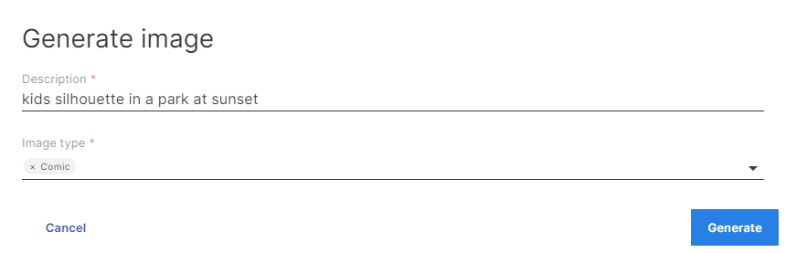

# nuxeo-generative-ai

This plugin for the [Nuxeo Platform](http://hyland/com/nuxeo) allows you to generate a random image through an AI model (OpenAI DALL-E) simply by describing what the image should be about (ex: *two small dogs playing in the forest crayon sketch*). If the generated image doesn't fit your needs, you can adjust your description and regenerate it until you find the right match. Once you're satisfied with the result, you can create a Nuxeo document out of the generated image.

## Configuration

Add to your nuxeo.conf the following configurations:

- `generative.ai.openai.apikey=${API_KEY}` => you must replace `${API_KEY}` with your own OpenAI API key.
- `generative.ai.openai.organization=${ORGANIZATION}` => `${ORGANIZATION}` defaults to *Nuxeo* if you don't specify it.

## Usage

You can generate images by clicking the "Generate Image"  button available in the DOCUMENT_ACTIONS toolbar. 
The button is visible only for `Folder` and `Workspace` document types by default, but you can adjust this as needed by setting: `generative.ai.imagegenerator.containerDocTypes=Workspace,Folder`.

In order to generate the image you must set two parameters:
- **Description**: a detailed description of what the generated image should be about (ex: *kids silhouette in a park at sunset*)
- **Image type**: pick one or more of the predefined image types to give the generated image a specific look (Photorealistic, Comic, Drawing, Impressionist, Abstract, Newspaper, Painting)



After the image is generated you choose to regenerate or create a document with it. 

The type of the document that is created is configurable and defaults to `Picture`. You can change it by setting: `generative.ai.imagegenerator.docType=Picture`.


## Build

```
git clone https://github.com/nuxeo-generative-ai.git
cd nuxeo-generative-ai
mvn clean install
```

####License

Licensed under the Apache License, Version 2.0 (the "License").
You may not use this file except in compliance with the License.
You may obtain a copy of the License at http://www.apache.org/licenses/LICENSE-2.0

---

## About Nuxeo

Nuxeo Platform is an open source Content Services platform, written in Java.
Data can be stored in both SQL & NoSQL databases.

The development of the Nuxeo Platform is mostly done by Nuxeo employees with an open development model.

The source code, documentation, roadmap, issue tracker, testing, benchmarks are all public.

Typically, Nuxeo users build different types of information management solutions for [document management](https://www.nuxeo.com/solutions/document-management/), [case management](https://www.nuxeo.com/solutions/case-management/), and [digital asset
management](https://www.nuxeo.com/solutions/dam-digital-asset-management/), use cases. It uses schema-flexible metadata & content models that allows content to be repurposed to fulfill future use cases.

More information is available at [hyland.com/nuxeo](https://hyland.com/nuxeo).
